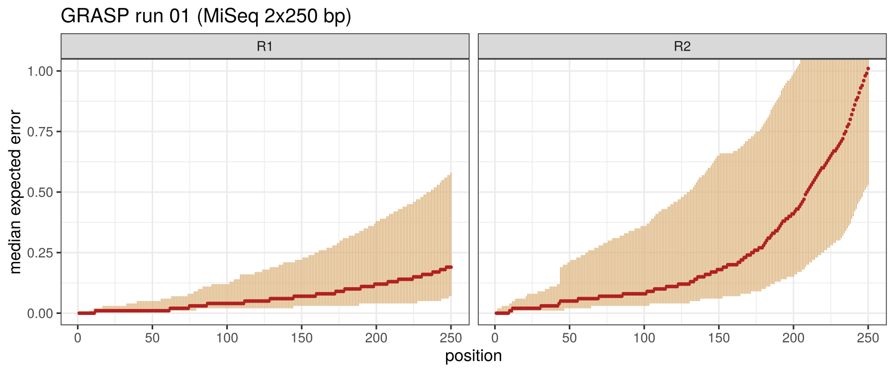
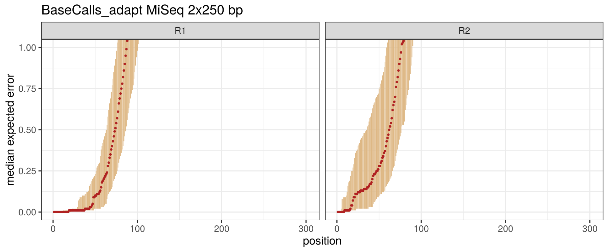
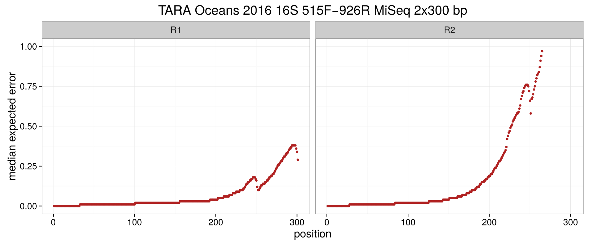
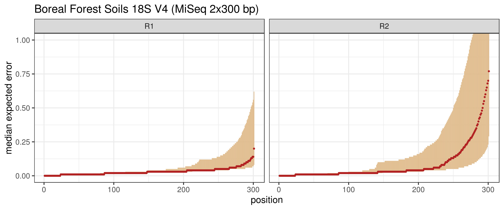
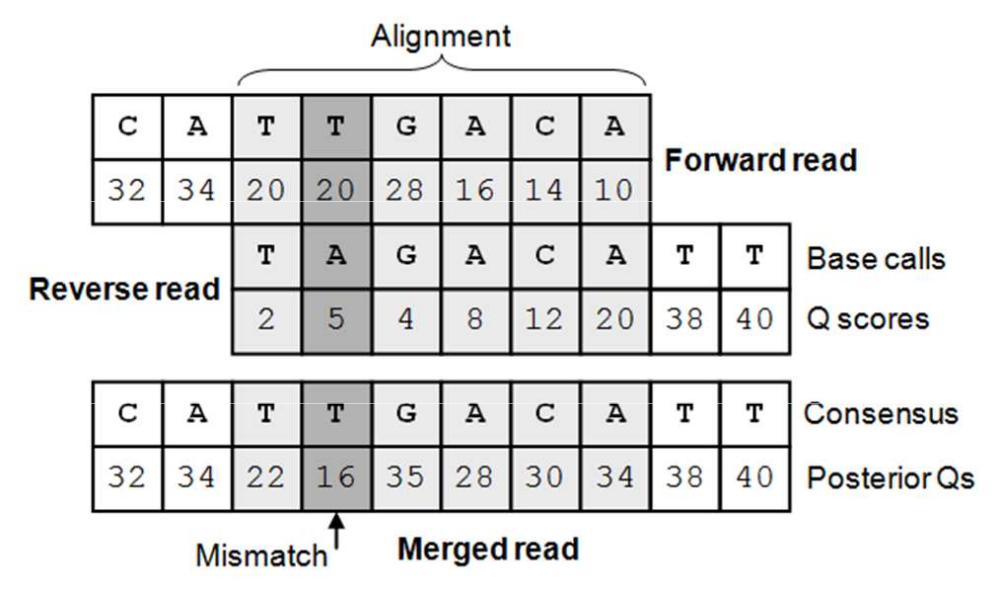
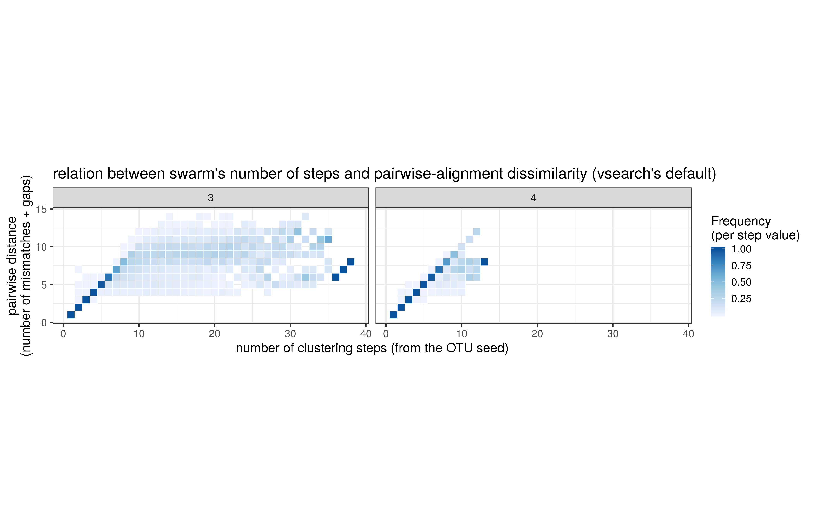
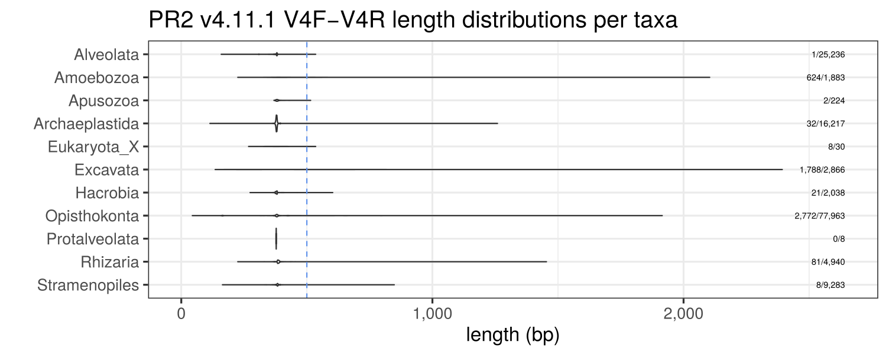

# Metabarcoding
### easy-peasy


<!-- ----------------------------------------------------------------

                            Prologue

    ----------------------------------------------------------------
-->

live presentation:

https://dna.uio.no/metabarcoding/reveal.js-3.7.0/

source:

https://github.com/frederic-mahe/metabarcoding-course-Oslo-2019


## Metabarcoding
#### born of phylogeny

Note: to build a phylogeny, one needs to sequence the same gene from
    many known species. Once such a reference database is available,
    barcoding and metabarcoding become possible (sequence-based
    identification of one or many organisms).


## What you will not find here

* primer design
* experiment design
* DNA extraction and sequencing
* numerical ecology and stats


## What you will find here

* FASTQ merging
* primer clipping
* clustering
* quality filtering
* chimera detection
* table of occurrences


<!-- ----------------------------------------------------------------

                            Code reminder

    ----------------------------------------------------------------
-->
## a primer on code

Command line interface (shell)


## login

``` bash
ssh abel.uio.no

# reserve a cpu and some memory:
qlogin --account ln0002k --ntasks 1 --mem-per-cpu 3800M

# To access all the installed software for the course:
source /cluster/software/BIO9905/set.source

# data and scripts are here:
/work/tmp/BIO9905MERG1/torognes/fred
```


#### Tools

* [vsearch](https://github.com/torognes/vsearch),
* [cutadapt](https://github.com/marcelm/cutadapt/),
* [swarm](https://github.com/torognes/swarm),
* bash v4+,
* GNU tools (awk, grep, sed, etc.)
* python 2


#### code block

My pipeline is made of blocks of shell code:

``` bash
# variables
THREADS=4
ENCODING=33

# some comments
vsearch \
    --threads ${THREADS} \
    --fastq_mergepairs R1.fastq.gz \
    --reverse R2.fastq.gz \
    --fastq_ascii ${ENCODING} \
    --fastq_allowmergestagger \
    --quiet \
    --fastqout out.fastq
```


#### redirect

``` bash
# basics
command > output.fastq
command 2> output.log
command 2> /dev/null
command < input.fastq

# but also
>>  2>>  2>&1  <(...)
```

Note: I've been writing shell scripts for 15 years, and I may use
    lesser known aspects of bash. Feel free to ask if my code is
    unclear.


#### wrap

``` bash
# too long to read:
vsearch --threads 4 --fastq_mergepairs R1.fastq.gz --reverse R2.fastq.gz --fastq_ascii 33 --fastq_allowmergestagger --quiet --fastqout out.fastq

# wrapping makes it more readable:
vsearch \
    --threads 4 \
    --fastq_mergepairs R1.fastq.gz \
    --reverse R2.fastq.gz \
    --fastq_ascii 33 \
    --fastq_allowmergestagger \
    --quiet \
    --fastqout out.fastq
```


#### pipe

make data flow

``` bash
# slow
command1 input.fastq > tmp1.fastq
command2 tmp1.fastq > tmp2.fastq
command3 tmp2.fastq > final_output.fastq

# piping avoids temporary files:
command1 input.fastq | \
    command2 | \
    command3 > final_output.fastq
```


#### tee

``` bash
# use a tee to save an intermediary result:
command1 input.fastq | \
    command2 | \
    tee output2.fastq | \
    command3 > final_output.fastq
```


#### test

``` bash
# create toy-examples:
printf ">s_1\nA\n"

# use them to test software behavior:
printf ">s_1\nA\n" | \
    swarm
```

Note: documentation rarely is 100% complete, when you have a doubt
about a tool, create a toy-example to test its behavior


<!-- ----------------------------------------------------------------

                                  FASTQ

    ----------------------------------------------------------------
-->

## FASTQ format


## FASTQ?

go to `./data/`

``` shell
zcat ES1A_S2_L001_R1_001.fastq.gz | less -S
```

``` text
@M05074:97:000000000-BPW9G:1:1101:10203:1383 1:N:0:2
CATAATTTCCTCCGCTTATTGATATGCTTAAGTTCAGCGGGTATCCCTACCTGATCCGAGTTCAACCTAAGAAAGTTGGGGGTTCTGGCGGGTGGACGGCTGAACCCTGTAGCGACAAGTATTACTACGCTTAGAGCCAGACGGCACCGCCACTGCTTTTAAGTGCCGCCGGTACAGCGGGCCCCAAGGCCAAGCAGAGCTTGATTGGTCA
+
@-A-9EFGFFFFD7BFF7FE9,C9F<EFG99,CEF9,@77+@+CCC@F9FCF9,C@C,,+,8C9<CEF,,,,,,,CF,,+++8FEF9,?+++@+++B++@C+,,B?FE8E,,<+++++3C,CF9DF9>>CFE7,,3=@7,,@++@:FC7BC*CC:,7>DF9,,,,7?*=B*5?*:++7***=?EE3***2;***:*0*/;@C8*<C+*<<+
```
note that the quality line starts with a @ ...

Note: Q values are a way to encode on one character numerical values
ranging from 0 to 40 (usually). These values represent the probability
of a wrong base calling for that particular position. Q20 means 1% of
risk, Q30 means 0.1% and Q40 means 0.01%.


## FASTQ format

* [FASTQ](https://en.wikipedia.org/wiki/FASTQ_format#Encoding)
* most frequent format
* human-readable
* hard to parse
* encode quality values (probability of error for each position)
* encoding type must be guessed


#### Paired-ends

``` shell
zcat ES1A_S2_L001_R1_001.fastq.gz | head -n 1
zcat ES1A_S2_L001_R2_001.fastq.gz | head -n 1
```

``` text
@M05074:97:000000000-BPW9G:1:1101:10203:1383 1:N:0:2
@M05074:97:000000000-BPW9G:1:1101:10203:1383 2:N:0:2
```
each R1 entry has a R2 counterpart.


#### check your files

usually provided by the sequencing facility, checks that files were
not modified during transfer:

``` bash
md5sum -c MD5SUM
```

``` text
ES1A_S2_L001_R1_001.fastq.gz: OK
ES1A_S2_L001_R2_001.fastq.gz: OK
```


#### in-depth stats on fastq files

[fastqc](https://github.com/s-andrews/FastQC) reports are often provided by sequencing facilities:
``` bash
# run FastQC
for f in *.fastq.gz ; do
    fastqc --quiet ${f}
done

# summarize with multiqc
multiqc --title "Boreal_Forest_Soils"
```
but I prefer to use vsearch.

Note: Håvard presented a fastqc plot Monday morning.


#### cumulative expected error (EE)

`$$ EE = \sum_{i=0}^n 10^{-Q/10} $$`

``` bash
# Summarize read quality
for PAIR in 1 2 ; do
    vsearch \
        --quiet \
        --fastq_eestats ES1A_S2_L001_R${PAIR}_001.fastq.gz \
        --output R${PAIR}_eestats.log
done
```
Visualize with some `R` and `tidyverse`

Note: EE is a positive, length-dependent, ever-growing value. EE = 1.0
is often used to discard reads (50% chance of no-error in the read).


try:
``` bash
head R1_eestats.log
```
Note: describe the table


``` text
Pos	Recs	PctRecs	Min_Q	Low_Q	Med_Q	Mean_Q	Hi_Q	Max_Q	Min_Pe	Low_Pe	Med_Pe	Mean_Pe	Hi_Pe	Max_Pe	Min_EE	Low_EE	Med_EE	Mean_EE	Hi_EE	Max_EE
1	3262836	100.0	12.0	34.0	34.0	33.8	34.0	34.0	0.0004	0.0004	0.0004	0.00069	0.0004	0.063	0.00	0.00	0.00	0.00	0.00	0.06
2	3262836	100.0	12.0	34.0	34.0	33.8	34.0	34.0	0.0004	0.0004	0.0004	0.00068	0.0004	0.063	0.00	0.00	0.00	0.00	0.00	0.13
3	3262836	100.0	12.0	34.0	34.0	33.8	34.0	34.0	0.0004	0.0004	0.0004	0.00063	0.0004	0.063	0.00	0.00	0.00	0.00	0.00	0.19
4	3262836	100.0	12.0	34.0	34.0	33.8	34.0	34.0	0.0004	0.0004	0.0004	0.0006	0.0004	0.063	0.00	0.00	0.00	0.00	0.00	0.25
5	3262836	100.0	12.0	34.0	34.0	33.8	34.0	34.0	0.0004	0.0004	0.0004	0.00058	0.0004	0.063	0.00	0.00	0.00	0.00	0.00	0.32
6	3262836	100.0	10.0	38.0	38.0	37.7	38.0	38.0	0.00016	0.00016	0.00016	0.0003	0.00016	0.1	0.00	0.00	0.00	0.00	0.00	0.42
7	3262836	100.0	10.0	38.0	38.0	37.7	38.0	38.0	0.00016	0.00016	0.00016	0.0003	0.00016	0.1	0.00	0.00	0.00	0.00	0.00	0.46
8	3262836	100.0	10.0	38.0	38.0	37.7	38.0	38.0	0.00016	0.00016	0.00016	0.00032	0.00016	0.1	0.00	0.00	0.00	0.00	0.00	0.52
9	3262836	100.0	10.0	38.0	38.0	37.6	38.0	38.0	0.00016	0.00016	0.00016	0.00035	0.00016	0.1	0.00	0.00	0.00	0.00	0.00	0.58
```


R code to produce the next plots:
``` R
library(tidyverse)

setwd("/scratch/mahe/projects/Oslo_20190325/data/")
title <- "Boreal Forest Soils 18S V4 (MiSeq 2x300 bp)"
output <- "R1_vs_R2_quality.pdf"

## Load data
all_sets <- data.frame()
for (read in c("R1", "R2")) {
    input <- paste("./", read, "_eestats.log", sep = "")

    a <- read.table(input, sep = "\t", header = TRUE) %>%
        tbl_df() %>%
        select(Pos, Min_EE, Low_EE, Med_EE, Hi_EE, Max_EE) %>%
        mutate(read = read)
    all_sets <- bind_rows(all_sets, a)
}

## Plot (facets)
ggplot(data = all_sets, aes(x = Pos, y = Med_EE)) +
    geom_linerange(aes(ymin = Low_EE, ymax = Hi_EE), colour = "burlywood") +
    geom_point(shape = 19, size = 1, color = "firebrick") +
    scale_x_continuous() +
    theme_bw(base_size = 16) +
    ggtitle(title) +
    xlab("position") +
    ylab("median expected error") +
    facet_grid(. ~ read) +
    coord_cartesian(ylim = c(0, 1.0))

ggsave(output, width = 12, height = 5)

output <- "R1_vs_R2_quality_boreal.png"
ggsave(output, width = 12, height = 5)

quit(save = "no")
```


## good run




## bad run




## mixed run




## our run




## guess quality encoding

yes, we need to guess

``` bash
vsearch --fastq_chars ES1A_S2_L001_R1_001.fastq.gz 
```

``` text
vsearch v2.11.1_linux_x86_64, 62.8GB RAM, 8 cores
https://github.com/torognes/vsearch

Reading FASTQ file 100%  
Read 3262836 sequences.
Qmin 40, QMax 71, Range 32
Guess: -fastq_qmin 7 -fastq_qmax 38 -fastq_ascii 33
Guess: Original Sanger format (phred+33)

Letter          N   Freq MaxRun
------ ---------- ------ ------
     A  249004917  25.4%     38
     C  243506540  24.8%    222
...
```
Note: most fastq files use an offset of 33, but beware that you might
encounter older fastq files using a 64 offset.


## SFF files

vsearch can read them.

Note: Roche 454 sequencing format, popular about 10 years ago. There
are more than 60,000 datasets in that format available on Short Read
Archive.


<!-- ----------------------------------------------------------------

                                Merge

    ----------------------------------------------------------------
-->

## Merging


## Merge R1 and R2 reads

``` bash
FORWARD="ES1A_S2_L001_R1_001.fastq.gz"
REVERSE="${FORWARD/_R1_/_R2_}"
OUTPUT="${FORWARD/_L001*/.fastq}"
LOG="${FORWARD/_L001*/.log}"
ENCODING=33
THREADS=1

vsearch \
    --threads ${THREADS} \
    --fastq_mergepairs ${FORWARD} \
    --reverse ${REVERSE} \
    --fastq_ascii ${ENCODING} \
    --fastq_allowmergestagger \
    --fastqout ${OUTPUT} 2> ${LOG}
```
creates `ES1A_S2.fastq` and `ES1A_S2.log`
Note: allowmergestagger allows to merge reads that are shorter than
the read-length.


## Merging log

``` text
Merging reads
 100%
   3262836  Pairs
   3071725  Merged (94.1%)
    191111  Not merged (5.9%)

Pairs that failed merging due to various reasons:
      3065  too few kmers found on same diagonal
      7936  multiple potential alignments
    115676  too many differences
     64430  alignment score too low, or score drop to high
         4  overlap too short

Statistics of all reads:
    301.00  Mean read length

Statistics of merged reads:
    408.80  Mean fragment length
     53.34  Standard deviation of fragment length
      0.46  Mean expected error in forward sequences
      1.21  Mean expected error in reverse sequences
      0.17  Mean expected error in merged sequences
      0.28  Mean observed errors in merged region of forward sequences
      0.95  Mean observed errors in merged region of reverse sequences
      1.23  Mean observed errors in merged region
```
Note: Torbjørn can help explaining each line.


## Merging theory



Note: from Edgar and Flyvberg, 2015. Merging is an important step that
can change radically the apparent diversity profile of a community
(some popular mergers do not cope well with variable length
markers). Some mergers use the wrong way to compute double-read
quality values.


## my EE filtering method

* EE / length is constant for read-long markers,
* quality is very high (double-read),
* longer markers accumulate EE, 
* false positives are inevitable
* no early quality-based filtering in my pipeline,
* filtering is done after clustering


<!-- ----------------------------------------------------------------

                                Demultiplex

    ----------------------------------------------------------------
-->

## Demultiplexing


* add a unique short sequence (tag) to all the sequences in a sample,
* pool all the samples into a library,
* sequence that library,
* use the tags to link each sequence to a sample

Note: libraries can be multiplexed too (using indexes). That can lead
to cross-library contaminations (index jumping, estimated to be around
0.1% of the reads).


## Tag list

``` bash
cat sample_barcode.tsv
```

``` text
S001	NAACAAC	NNAACAAC
S002	NNAACCGA	NNNAACCGA
S003	NNNCCGGAA	NCCGGAA
S004	NAGTGTT	NNAGTGTT
S005	NNCCGCTG	NNNCCGCTG
S006	NNNAACGCG	NAACGCG
S007	NGGCTAC	NNGGCTAC
S008	NNTTCTCG	NNNTTCTCG
S009	NNNTCACTC	NTCACTC
S010	NGAACTA	NNGAACTA
S011	NNCCGTCC	NNNCCGTCC
S012	NNNAAGACA	NAAGACA
S013	NCGTGCG	NNCGTGCG
S014	NNGGTAAG	NNNGGTAAG
S015	NNNATAATT	NATAATT
S016	NCGTCAC	NNCGTCAC
S017	NNTTGAGT	NNNTTGAGT
S018	NNNAAGCAG	NAAGCAG
S019	NTTGCAA	NNTTGCAA
S020	NNCACGTA	NNNCACGTA
S021	NNNTAACAT	NTAACAT
S022	NTGCGTG	NNTGCGTG
S023	NNGGTCGA	NNNGGTCGA
S024	NNNCACTCT	NCACTCT
S025	NCTTGGT	NNCTTGGT
S026	NNTCCAGC	NNNTCCAGC
S027	NNNACTTCA	NACTTCA
S028	NGCGAGA	NNGCGAGA
S029	NNTGGAAC	NNNTGGAAC
S030	NNNGTACAC	NGTACAC
S031	NAAGTGT	NNAAGTGT
S032	NNTCTTGG	NNNTCTTGG
S033	NNNAAGGTC	NAAGGTC
S034	NGGCGCA	NNGGCGCA
S035	NNTCGACG	NNNTCGACG
S036	NNNCCTGTC	NCCTGTC
S037	NAGAAGA	NNAGAAGA
S038	NNAATAGG	NNNAATAGG
S039	NNNGGTTCT	NGGTTCT
S040	NTAATGA	NNTAATGA
S041	NNGTAACA	NNNGTAACA
S042	NNNAATCCT	NAATCCT
S043	NAGACCG	NNNAGACCG
S044	NNNTGGCGG	NTGGCGG
S045	NCTATAA	NNCTATAA
S046	NNAATGAA	NNNAATGAA
S047	NNNCGAATC	NCGAATC
S048	NAGAGAC	NNAGAGAC
```
Note: does anyone can explain the Ns?


## Illumina needs variability

and metabarcoding has little

``` text
CCAGCAGCTGCGGTAATTCCAGCTCCAATAGCGTATATTTAAGTTGTTGC...
CCAGCAGCCGCGGTAATTCCAGCTCCAATAGCGTATATTTAAGTTGTTGC...
CCAGCACCTGCGGTAATTCCAGCTCCAATAGCGTATATTTAAGTTGTTGC...
CCAGCAGCCGCGGTAATTCCAGCTCCAATAGCGTATATTTAAGTTGTTGC...
CCAGCAGCTGCGGTAATTCCAGCTCCAATAGCGTATATTAAAGTTGTTGC...
CCAGCAGCTGCGGTAATTCCAGCTCCAATAGCGTATATTAAAGTTGTTGC...
CCAGCAGCCGCGGTAATTCCAGCTCCAATAGCGTATATTTAAGTTGTTGC...
```
* first 5 nucleotides are used to delineate clusters,
* first 25 nucleotides are used to calibrate base-calling (expects equal proportions)

Note: Ns introduce variability in the first flow cycles (4 possible
nucleotides), and variable numbers of N create shifts and even more
variability in the rest of the flow cycles.


## demultiplex with cutadapt

``` bash
INPUT_FASTQ="ES1A_S2.fastq"
TAGS="sample_barcode.tsv"
TMP_BARCODES=$(mktemp)

# cutadapt wants tags in a fasta file, not a table
awk '{print ">"$1"\n^"$2}' "${TAGS}" > ${TMP_BARCODES}

# demultiplex (tags are 5' anchored)
cutadapt \
    --no-indels \
    -g file:${TMP_BARCODES} \
    -o "{name}.fastq.gz" ${INPUT_FASTQ}

rm ${TMP_BARCODES}  # clean
```

Note: launch first and describe while it is running. We search for
exact tags, but you might want to allow 1 error (-e 0.15). Also, we
did not use the fact that tags are present at both ends.


## vsearch presentation

Note: by Torbjørn


<!-- ----------------------------------------------------------------

                                  Trim

    ----------------------------------------------------------------
-->

## Primer clipping


The goal is to search . So far we have used cutadapt to find tags at
the beginning of sequences. Now we are going to allow cutadapt to
search anywhere in the reads.


## complete script

``` bash
# Trim primers, convert to fasta and extract expected error values
PRIMER_F="CCAGCASCYGCGGTAATTCC"
PRIMER_R="TYRATCAAGAACGAAAGT"
MIN_LENGTH=32
MIN_F=$(( ${#PRIMER_F} * 2 / 3 ))  # primer match is >= 2/3 of primer length
MIN_R=$(( ${#PRIMER_R} * 2 / 3 ))
CUTADAPT="cutadapt --discard-untrimmed --minimum-length ${MIN_LENGTH}"
TMP_FASTQ=$(mktemp)
TMP_FASTQ2=$(mktemp)
TMP_FASTA=$(mktemp)

for INPUT in S*.fastq.gz ; do
    LOG="${INPUT/.fastq.gz/.log}"
    FINAL_FASTA="${INPUT/.fastq.gz/.fas}"
    QUALITY_FILE="${INPUT/.fastq.gz/.qual}"

    # Reverse-complement fastq file, trim forward & reverse primers
    # (search normal and antisens dataset)
    (zcat "${INPUT}"
    vsearch \
         --quiet \
         --fastx_revcomp "${INPUT}" \
         --fastqout -) | \
        ${CUTADAPT} -g "${PRIMER_F}" -O "${MIN_F}" - 2> "${LOG}" | \
        ${CUTADAPT} -a "${PRIMER_R}" -O "${MIN_R}" - 2>> "${LOG}" > "${TMP_FASTQ}"

    # Discard sequences containing Ns, add expected error rates
    vsearch \
        --quiet \
        --fastq_filter "${TMP_FASTQ}" \
        --fastq_maxns 0 \
        --relabel_sha1 \
        --eeout \
        --fastqout "${TMP_FASTQ2}" 2>> "${LOG}"

    # Discard sequences containing Ns, convert to fasta
    vsearch \
        --quiet \
        --fastq_filter "${TMP_FASTQ}" \
        --fastq_maxns 0 \
        --fastaout "${TMP_FASTA}" 2>> "${LOG}"

    # Dereplicate at the study level
    vsearch \
        --quiet \
        --derep_fulllength "${TMP_FASTA}" \
        --sizeout \
        --fasta_width 0 \
        --relabel_sha1 \
        --output "${FINAL_FASTA}" 2>> "${LOG}"

    # Discard quality lines, extract hash, expected error rates and read length
    sed 'n;n;N;d' "${TMP_FASTQ2}" | \
        awk 'BEGIN {FS = "[;=]"}
             {if (/^@/) {printf "%s\t%s\t", $1, $3} else {print length($1)}}' | \
                 tr -d "@" | \
                 sort -k3,3n -k1,1d -k2,2n | \
                 uniq --check-chars=40 > "${QUALITY_FILE}"
done

# Clean
rm -f "${TMP_FASTQ}" "${TMP_FASTA}" "${TMP_FASTQ2}"
```

Note: this script does a lot of things, and it loops other all fastq
files. Keep in mind you don't need to understand all the
code. Usually, you just need to change file names at the beginning to
adapt it to your dataset. Let's look at it step-by-step. This script
could be much more compact if we were to use pipes, but it would be
also less readable.


## fastq reverse-complement

Let's process S001.fastq.gz:

``` bash
# search normal and antisens dataset
(zcat S001.fastq.gz
 vsearch \
     --quiet \
     --fastx_revcomp S001.fastq.gz \
     --fastqout -) | \
     ...
```

Note: reads are reversed and complemented. Usefull when sequencing
direction is random, and reads can be in any orientation. Not very
frequent though.


## trim

``` bash
... | \
    cutadapt \
        --discard-untrimmed \
        --minimum-length 32 \
        -g "${PRIMER_F}" \
        -O "${MIN_F}" - 2> "${LOG}" | \
    cutadapt \
        --discard-untrimmed \
        --minimum-length 32 \
        -a "${PRIMER_R}" \
        -O "${MIN_R}" - 2>> "${LOG}" > "${TMP_FASTQ}"
```

Note: eliminate reads of length below 32 nucleotides, eliminate reads
that do not contain the primers.


check what cutadapt does:

``` bash
# -g, cut after the occurence closest to 5'
printf ">test\naaaACGTggggACGTaaaaa\n" | \
    cutadapt -g ACGT -O 4 - 2> /dev/null
```

``` text
>test
ggggACGTaaaaa
```

``` bash
# -a, cut before the occurence most distant to 3'
printf ">test\naaaACGTggggACGTaaaaa\n" | \
    cutadapt -a ACGT -O 4 - 2> /dev/null
```

``` text
>test
aaa
```


## convert to fasta

``` bash
# convert to fasta (discard reads with Ns)
vsearch \
    --quiet \
    --fastq_filter "${TMP_FASTQ}" \
    --fastq_maxns 0 \
    --fastaout "${TMP_FASTA}"
```


## dereplicate

``` bash
# Dereplicate at the sample level
vsearch \
    --quiet \
    --derep_fulllength "${TMP_FASTA}" \
    --sizeout \
    --fasta_width 0 \
    --relabel_sha1 \
    --output S001.fas
```

Note: discard read names and replace them with hash-values.


``` text
>f414cfec8c1cc3973e95e67cff46299a00e8368a;size=8204
AGCTCCAATAGCGTATATTTAAGTTGTTGCAGTTAAAAAGCTCGTAGTTGGATCTTGGGTCGTAAAGGTCGGTCCGCCTACTCGGTGTGCACCTGCCCTTCCGTCCCTTTTGCCGGCGGCGTGCTCCTGGCCTTAATTGGCTGGGTCGCGGTTCCGGCGTTGTTACTTTGAAAAAATTAGAGTGCTCAAAGCAAGCTTATGCTCTGAATACATTAGCATGGAATAACGCGATAGGAGTCTGGTCCTATTGTGTTGGCCTTCGGGACCGGAGTAATGATTAATAGGGACTGTCGGGGGCATTCGTATTTCATTGTCAGAGGTGAAATTCTTGGATTTATGAAAGACGAACCACTGCGAAAGCATTTGCCAAGGATGTTTTCA
>ea5b349a8215a8b8ca2de29f0a33087b7c7d5e77;size=496
AGCTCCAATAGCGTATATTTAAGTTGTTGCAGTTAAAAAGCTCGTAGTTGGATTTTGGGTTGGGTCGATCGGTCCGCCTTTGGTGTGCACCTGTCGTCTCGTCCCTTCTGCCGGCGATACGCTCCTGGCCTTAATTGGCCGGGTCGTGCCTCCGGCGCTGTTACTTTGAAGAAATTAGAGTGCTCAAAGCAAGCCTACGCTCTGGATACATTAGCATGGGATAACACCATAGGATTTCGATCCTATTCTGTTGGCCTTCGGGATCGGAGTAATGATTAACAGGGACAGTCGGGGGCATTCGTATTTCATAGTCAGAGGTGAAATTCTTGGATTTATGAAAGACGAACAACTGCGAAAGCATTTGCCAAGGATGTTTTCA
>12ef3a4e79dd0f7419f257c7641963e49c83d4fa;size=199
AGCTCCAATAGCGTATATTTAAGTTGTTGCAGTTAAAAAGCTCGTAGTTGGATCTTGGGTCGTAAAGGTCGGTCCGCCTACTCGGTGTGCACCTGCCCTTCCGTCCCTTTTGCCGGCGGCGTGCTCCTGGCCTTAATTGGCTGGGTCGCGGTTCCGGCGTTGTTACTTTGAAAAAATTAGAGTGCTCAAAGCAAGCTTATGCTCTGAATACATTAGCATGGAATAACGCGATAGGAGTCTGGTCCTATTGTGTTGGCCTTCGGGACCGGAGTAATGATTAATAGGGACTGTCGGGGGCATTCGTATTTCAATGTCAGAGGTGAAATTCTTGGATTTATGAAAGACGAACCACTGCGAAAGCATTTGCCAAGGATGTTTTCA
>16b79e33e7897ca08ecaa282dc4b4ba1e6d6b460;size=166
AGCTCCAATAGCGTATATTAAAGTTGTTGCAGTTAAAAAGCTCGTAGTTGGATCTCGGGTCCAGGCTCGCGGTTCGTTTCGCGACGATACTGCCCGTCCTGACCTACCTCCCGGTTTTCCCCCGGTGCTCTTCGCTGAGTGCCTCGGGTGGCCGGAACGTTTACTTTGAAAAAATTAGAGTGCTCAAAGCAGGCAGTCTGCCTGAATAACCGCGCATGGAATAATGGAATAGGACCTCGGTTCTATTTTGTTGGTTTTCGGAACTTGAGGTAATGATTAAGAGGGACAGACGGGGGCATTCGTATTACGGTGTTAGAGGTGAAATTCTTGGATCGCCGTAAGACGAACTACTGCGAAAGCATTTGCCAAGAATGTTTTCA
```


## hash values as sequence names

* easy to compute,
* compact fix length name,
* readable (you get use to it),
* a given sequence will always produce the same hash,
* allows cross-studies comparisons


## compute expected error values

``` bash
# and discard reads with Ns
vsearch \
    --quiet \
    --fastq_filter "${TMP_FASTQ}" \
    --fastq_maxns 0 \
    --relabel_sha1 \
    --eeout \
    --fastqout "${TMP_FASTQ2}"
```

Note: in parallel to the fasta conversion, we compute expected error
values and we extract them for later usage.


## extract expected error values

``` bash
# extract hash, expected error rates and read length
sed 'n;n;N;d' "${TMP_FASTQ2}" | \
    awk 'BEGIN {FS = "[;=]"}
               {if (/^@/) {printf "%s\t%s\t", $1, $3}
                else {print length($1)}}' | \
                   tr -d "@" | \
                   sort -k3,3n -k1,1d -k2,2n | \
                   uniq --check-chars=40 > S001.qual
```


``` bash
head S001.qual
```

``` text
dd565a212fcb2c31c1d805753c45a264223da3a2	0.0036	44
5f745d9ae8bdb14d84d9951c6fa10e0eb668dc79	0.0273	93
f9e090a0724048b3854b2683da4f8167bb5ebfa9	0.0074	93
6510220e6c2e1954cbeb78625db4c3f8da9e24ea	0.0075	95
2daf54b6c5f1bdcd300b7e2da9d178c8c1a02a93	0.0079	100
7b8f17246a09fba90892bd442394b7511c4179dc	0.0079	100
7a38a897a9f3d7d992a31afc85a1210435707767	0.0114	143
0efb5c8e79af00068e69369c60954cf47b0a0f0c	0.0114	144
380c8720e39965336eb996311b0333af93afeb9d	0.0114	144
57eea90eb9599ddc6a16bd4badcbacd2895454c3	0.0114	144
```

keeps the lowest EE for each sequence


The `for` loop repeats the process for each fastq file in the project.


<!-- ----------------------------------------------------------------

                          Global clustering

    ----------------------------------------------------------------
-->

## Clustering


``` bash
cd ../results/
```


## Global dereplication

``` bash
## pool all samples and dereplicate
cat ../data/S[0-9][0-9]*.fas | \
    vsearch \
        --derep_fulllength - \
        --sizein \
        --sizeout \
        --fasta_width 0 \
        --output Boreal_forest_soils_18SV4_48_samples.fas
```

Note: we need to dereplicate first. This time we use --sizein to take
into account the results of sample-level dereplications.


``` text
vsearch v2.12.0_linux_x86_64, 376.6GB RAM, 48 cores
https://github.com/torognes/vsearch

Dereplicating file - 100%
134902580 nt in 356347 seqs, min 34, max 539, avg 379
Sorting 100%
248072 unique sequences, avg cluster 4.3, median 1, max 221209
Writing output file 100%
```

Note: note the discrepancy between average and mediane. vsearch is
your tool in a way, feel free to ask for features or clarifications if
your needs are not covered.


## Clustering

``` bash
## Clustering
FINAL_FASTA="Boreal_forest_soils_18SV4_48_samples.fas"
TMP_REPRESENTATIVES="$(mktemp)"

swarm \
    -d 1 -f -t 1 -z \
    -i "${FINAL_FASTA/.fas/_1f.struct}" \
    -s "${FINAL_FASTA/.fas/_1f.stats}" \
    -w "${TMP_REPRESENTATIVES}" \
    -o "${FINAL_FASTA/.fas/_1f.swarms}" \
    "${FINAL_FASTA}"
```

Note: swarm outputs clusters and cluster representatives in fasta
format. swarm can also output interesting stats and a description of
the internal structure of the clusters. We are going to use all these
files.


``` text
Swarm 2.2.2 [Jan 21 2019 22:29:45]
Copyright (C) 2012-2019 Torbjorn Rognes and Frederic Mahe
https://github.com/torognes/swarm

Mahe F, Rognes T, Quince C, de Vargas C, Dunthorn M (2014)
Swarm: robust and fast clustering method for amplicon-based studies
PeerJ 2:e593 https://doi.org/10.7717/peerj.593

Mahe F, Rognes T, Quince C, de Vargas C, Dunthorn M (2015)
Swarm v2: highly-scalable and high-resolution amplicon clustering
PeerJ 3:e1420 https://doi.org/10.7717/peerj.1420

CPU features:      mmx sse sse2 sse3 ssse3 sse4.1 sse4.2 popcnt avx avx2
Database file:     Boreal_forest_soils_18SV4_48_samples.fas
Output file:       Boreal_forest_soils_18SV4_48_samples_1f.swarms
Statistics file:   Boreal_forest_soils_18SV4_48_samples_1f.stats
Resolution (d):    1
Threads:           1
Break OTUs:        Yes
Fastidious:        Yes, with boundary 3

Reading database:  100%
Indexing database: 100%
Database info:     93905369 nt in 248072 sequences, longest 539 nt
Hashing sequences: 100%
Clustering:        100%

Results before fastidious processing:
Number of swarms:  86193
Largest swarm:     36648

Counting amplicons in heavy and light swarms 100%
Heavy swarms: 7537, with 167534 amplicons
Light swarms: 78656, with 80538 amplicons
Total length of amplicons in light swarms: 30508515
Bloom filter: bits=16, m=3416953680, k=11, size=407.3MB
Adding light swarm amplicons to Bloom filter 100%
Generated 204824711 variants from light swarms
Checking heavy swarm amplicons against Bloom filter 100%
Heavy variants: 425554746
Got 135072 graft candidates
Grafting light swarms on heavy swarms 100%
Made 31505 grafts

Writing swarms:    100%
Writing seeds:     100%
Writing structure: 100%
Writing stats:     100%

Number of swarms:  54688
Largest swarm:     43300
Max generations:   15
```

Note: swarm's log contains a lot of information. The most important
ones are the number of clusters, the number of unique sequences in the
largest cluster, and the memory consumption. The term OTU is now used
to designate 97%-based clusters. In that sense swarm produces ASVs.


``` bash
## Sort representatives sequences
vsearch \
    --fasta_width 0 \
    --quiet \
    --sortbysize ${TMP_REPRESENTATIVES} \
    --output ${FINAL_FASTA/.fas/_1f_representatives.fas}

rm ${TMP_REPRESENTATIVES}  # clean up
```

Note: necessary after using fastidious


## stats file

``` text
43300	386975	f414cfec8c1cc3973e95e67cff46299a00e8368a	221209	36958	15	15
9843	89595	ea5b349a8215a8b8ca2de29f0a33087b7c7d5e77	52845	8270	9	9
4328	28990	16b79e33e7897ca08ecaa282dc4b4ba1e6d6b460	16362	3303	5	5
4766	33818	d6b85081181a3db6eaf25802a67c3f796bb3f27a	14970	3309	8	8
3682	22627	0c325f613a453023deeab86ac6bbe2e6d46261fe	11370	2749	8	8
2790	18567	b36588b4e56203aab87f970e1f96a2bc88b503d9	9374	1959	5	5
2206	14581	05ea896948cbe431843a24d6913a3a7824a86c6c	9024	1559	6	6
729	10897	d7075b3abeb23e4280d0eddbb917c2b265a73955	8404	409	3	3
7024	27342	68ea7ef4166ab17957de23df7876c70c6b19fa1c	8198	5529	9	9
3233	18277	4d53f7da17c0c170de344ddd8a02fffa979dc975	7106	2325	6	6
```

Note: describe the first OTU (unique, reads, seed, seed abundance,
sequence;size=1, number of steps. 15 steps, is that a lot? not really,
aggregation paths are not straightforward. We can actually compute for
each sequence in the cluster its actual number of differences with the
seed.




Note: it is far less that expected, and rarely more than 10
differences for 380 bp sequences (2.6% divergence).


## struct file

``` text
f414cfec8c1cc3973e95e67cff46299a00e8368a	0e0f4fe23436e7a5df250f03f2446c2ea347cde8	1	1	1
f414cfec8c1cc3973e95e67cff46299a00e8368a	12ef3a4e79dd0f7419f257c7641963e49c83d4fa	1	1	1
f414cfec8c1cc3973e95e67cff46299a00e8368a	e74f16e7aaeaae903b09ddb6d9f16c66acd47f9a	1	1	1
f414cfec8c1cc3973e95e67cff46299a00e8368a	cee77b2ab82a0fccc51a208174dfba414a788059	1	1	1
f414cfec8c1cc3973e95e67cff46299a00e8368a	1cc192bab8b1ae28aadbaa4baa849a9b0ab47c92	1	1	1
f414cfec8c1cc3973e95e67cff46299a00e8368a	f1cb3936a60fd44b23636cecc53fa57fdc1488f4	1	1	1
f414cfec8c1cc3973e95e67cff46299a00e8368a	f66a9577412ede9d25af6fcfce1e69a2831fa221	1	1	1
f414cfec8c1cc3973e95e67cff46299a00e8368a	c5c747056ba9ebe5754da85b2055593681afd860	1	1	1
f414cfec8c1cc3973e95e67cff46299a00e8368a	5ed576304ceb2366ab38e9e5c0bce8ffbc975414	1	1	1
f414cfec8c1cc3973e95e67cff46299a00e8368a	298d9e7031aec43ddcfb190a22b0708ad35eda69	1	1	1
```

Note: X is the parent of Y (1 difference), we are in layer Z.


## representatives

``` text
>f414cfec8c1cc3973e95e67cff46299a00e8368a;size=386975;
AGCTCCAATAGCGTATATTTAAGTTGTTGCAGTTAAAAAGCTCGTAGTTGGATCTTGGGTCGTAAAGGTCGGTCCGCCTACTCGGTGTGCACCTGCCCTTCCGTCCCTTTTGCCGGCGGCGTGCTCCTGGCCTTAATTGGCTGGGTCGCGGTTCCGGCGTTGTTACTTTGAAAAAATTAGAGTGCTCAAAGCAAGCTTATGCTCTGAATACATTAGCATGGAATAACGCGATAGGAGTCTGGTCCTATTGTGTTGGCCTTCGGGACCGGAGTAATGATTAATAGGGACTGTCGGGGGCATTCGTATTTCATTGTCAGAGGTGAAATTCTTGGATTTATGAAAGACGAACCACTGCGAAAGCATTTGCCAAGGATGTTTTCA
>ea5b349a8215a8b8ca2de29f0a33087b7c7d5e77;size=89595;
AGCTCCAATAGCGTATATTTAAGTTGTTGCAGTTAAAAAGCTCGTAGTTGGATTTTGGGTTGGGTCGATCGGTCCGCCTTTGGTGTGCACCTGTCGTCTCGTCCCTTCTGCCGGCGATACGCTCCTGGCCTTAATTGGCCGGGTCGTGCCTCCGGCGCTGTTACTTTGAAGAAATTAGAGTGCTCAAAGCAAGCCTACGCTCTGGATACATTAGCATGGGATAACACCATAGGATTTCGATCCTATTCTGTTGGCCTTCGGGATCGGAGTAATGATTAACAGGGACAGTCGGGGGCATTCGTATTTCATAGTCAGAGGTGAAATTCTTGGATTTATGAAAGACGAACAACTGCGAAAGCATTTGCCAAGGATGTTTTCA
>d6b85081181a3db6eaf25802a67c3f796bb3f27a;size=33818;
AGCTCCAATAGCGTATATTTAAGTTGTTGCAGTTAAAAAGCTCGTAGTTGGATCTCGGGACGGGGAGAGCGGTCCGCCTCTTCTGGTGTGCACTGATCTCTCCGTCCTTTCTGTCGGGGACGCGCTCCTGGCCTTGATTGGCTGGGACGCGGAGTCGACGACGTTACTTTGAAAAAATTAGAGTGCTCAAAGCAAGCCTATGCTCTGAATACATTAGCATGGAATAACGCGATAGGACTCTGGTCCTGTTCCGTTGGTCTTCGGGACCGGAGTAATGATTAATAGGGACGGTTGGGGGCATTCGTATTTCATTGTCAGAGGTGAAATTCTTGGATTTATGAAAGACGAACTTCTGCGAAAGCATTTGCCAAGGATGTTTTCA
>16b79e33e7897ca08ecaa282dc4b4ba1e6d6b460;size=28990;
AGCTCCAATAGCGTATATTAAAGTTGTTGCAGTTAAAAAGCTCGTAGTTGGATCTCGGGTCCAGGCTCGCGGTTCGTTTCGCGACGATACTGCCCGTCCTGACCTACCTCCCGGTTTTCCCCCGGTGCTCTTCGCTGAGTGCCTCGGGTGGCCGGAACGTTTACTTTGAAAAAATTAGAGTGCTCAAAGCAGGCAGTCTGCCTGAATAACCGCGCATGGAATAATGGAATAGGACCTCGGTTCTATTTTGTTGGTTTTCGGAACTTGAGGTAATGATTAAGAGGGACAGACGGGGGCATTCGTATTACGGTGTTAGAGGTGAAATTCTTGGATCGCCGTAAGACGAACTACTGCGAAAGCATTTGCCAAGAATGTTTTCA
```

Note: abundance is the total number of reads in that cluster. 


## present swarm

Note: done by Frédéric


<!-- ----------------------------------------------------------------

                            Extra data

    ----------------------------------------------------------------
-->

## Useful extra data


## Global expected error values

``` bash
## Build expected error file
sort \
    -k3,3n \
    -k1,1d \
    -k2,2n \
    --merge ../data/S[0-9][0-9]*.qual | \
    uniq \
        --check-chars=40 \
        > Boreal_forest_soils_18SV4_48_samples.qual
```

Note: keep for each sequence the lowest EE value observed in any of
our sample.


## Global sequence distribution

``` bash
## sequence <-> sample relations
for f in ../data/S[0-9][0-9]*.fas ; do
    grep -H "^>" "${f}"
done | \
    sed 's/.*\/// ; s/.fas:>/\t/ ; s/;size=/\t/ ; s/;$//' | \
    awk 'BEGIN {FS = OFS = "\t"} {print $2, $1,$3}' \
        > Boreal_forest_soils_18SV4_48_samples.distr
```

Note: keep for each sequence the lowest EE value observed in any of
our sample.


``` bash
head Boreal_forest_soils_18SV4_48_samples.distr
```

``` text
f414cfec8c1cc3973e95e67cff46299a00e8368a	S001	7369
16b79e33e7897ca08ecaa282dc4b4ba1e6d6b460	S001	679
ea5b349a8215a8b8ca2de29f0a33087b7c7d5e77	S001	458
1f51f06217fa2ac348b50fea587702e29bfe1f1c	S001	315
288366fe126296cb6c6aec488dde3b25a6385d5f	S001	243
f59d28a1e80d582e07d0b224f07ac6e360a8acef	S001	154
e74f16e7aaeaae903b09ddb6d9f16c66acd47f9a	S001	139
be8e83ba27fa599c1eccb416e06131870ba101e6	S001	119
324f9ad3b7651dbbca36abd62ed9c39238db12c1	S001	98
2ba9bb0fe66318a974db3a580b23b3b1691f4a54	S001	87
```

Note: every sequence in the dataset, the samples where it occurs, and
its abundance in that sample.


## Local cluster seeds

``` bash
  ## clusterize each fasta file independently and get a list of OTU
  ## seeds (size 2+ only)
  i=0
  for FASTA in ../data/S[0-9][0-9]*.fas ; do
      FASTA_FILE="${FASTA/*\//}"
      FASTA_FILE="${FASTA_FILE/.fas/}"
      echo $(( ++i )) ${FASTA_FILE} > /dev/stderr
      "${SWARM}" \
          -d 1 \
          -f \
          -z \
          -t "${THREADS}" \
          -l /dev/null \
          -o /dev/null \
          -s - \
          "${FASTA}" | \
          awk \
              -v FASTA_FILE="${FASTA_FILE}" \
              'BEGIN {FS = OFS = "\t"}
               $2 > 2 {print FASTA_FILE, $0}'
  done > Boreal_forest_soils_18SV4_48_samples_per_sample_OTUs.stats
```

Note: TODO explain how it works.


``` text
S001    2965    13903   f414cfec8c1cc3973e95e67cff46299a00e8368a        7369    2306    6       6
S001    552     1522    16b79e33e7897ca08ecaa282dc4b4ba1e6d6b460        679     473     4       4
S001    311     873     ea5b349a8215a8b8ca2de29f0a33087b7c7d5e77        458     264     4       4
S001    220     593     1f51f06217fa2ac348b50fea587702e29bfe1f1c        315     199     3       3
S001    184     471     288366fe126296cb6c6aec488dde3b25a6385d5f        243     168     3       3
S001    131     314     f59d28a1e80d582e07d0b224f07ac6e360a8acef        154     119     2       2
S001    59      186     be8e83ba27fa599c1eccb416e06131870ba101e6        119     52      2       2
S001    58      163     324f9ad3b7651dbbca36abd62ed9c39238db12c1        98      54      2       2
S001    73      182     2ba9bb0fe66318a974db3a580b23b3b1691f4a54        87      66      3       3
S001    64      166     1dc51b7e4b3fa9ea546f0ef8afd89388484bf901        75      56      2       2
S001    60      144     0c325f613a453023deeab86ac6bbe2e6d46261fe        70      55      2       2
S001    47      111     08a5fe22b04b50169af6793e621be9649b12b798        55      41      4       4
S001    55      114     5d117c4ea1abf57ad3d031e379afc283e6a8ebc2        53      48      2       2
S001    39      93      405908dae0e618d416452e2c938b30ae36b12040        52      36      2       2
S001    38      86      7263c21dadfb866fe5f42503e0750b340c1772fa        48      36      3       3
S001    41      114     da5fbd349893e0d9f6780235339ea8a0dd8e3358        42      38      3       3
```


<!-- ----------------------------------------------------------------

                          Chimera detection

    ----------------------------------------------------------------
-->

## Chimeras

Note: TODO explain what they are.


## Chimera detection

``` bash
REPRESENTATIVES="Boreal_forest_soils_18SV4_48_samples_1f_representatives.fas"
UCHIME=${REPRESENTATIVES/.fas/.uchime}

vsearch \
    --uchime_denovo "${REPRESENTATIVES}" \
    --uchimeout "${UCHIME}"
```

Note: vsearch reimplements uchime, the most widely used chimera
detection tool. There is room for improvement.


``` text
vsearch v2.12.0_linux_x86_64, 376.6GB RAM, 48 cores
https://github.com/torognes/vsearch

Reading file Boreal_forest_soils_18SV4_48_samples_1f_representatives.fas 100%  
20633387 nt in 54688 seqs, min 34, max 539, avg 377
Masking 100% 
Sorting by abundance 100%
Counting k-mers 100% 
Detecting chimeras 100%  
Found 26354 (48.2%) chimeras, 26942 (49.3%) non-chimeras,
and 1392 (2.5%) borderline sequences in 54688 unique sequences.
Taking abundance information into account, this corresponds to
60430 (5.7%) chimeras, 988411 (93.5%) non-chimeras,
and 8076 (0.8%) borderline sequences in 1056917 total sequences.
```

Note: a high number of chimeras. This is usual for long markers such
as 18S V4. The data loss is small in terms of reads (6.5% in total). 


Chimera detection is complex and should be a priority research
field. Come and help us!


<!-- ----------------------------------------------------------------

                        Taxonomic assignment

    ----------------------------------------------------------------
-->

## Taxonomic assignment


## Reference dataset

* trim reference sequences (cutadapt),
* allow global pairwise alignments between env and ref


complete code

``` bash
# download the UTAX version
URL="https://github.com/vaulot/pr2_database/releases/download"
VERSION="4.11.1"
SOURCE="pr2_version_${VERSION}_UTAX.fasta"
[[ -e "${SOURCE}.gz" ]] || \
    wget "${URL}/${VERSION}/${SOURCE}.gz"

# declare variables
PRIMER_F="CCAGCASCYGCGGTAATTCC"
PRIMER_R="TYRATCAAGAACGAAAGT"
OUTPUT="${SOURCE/_UTAX*/}_${PRIMER_F}_${PRIMER_R}.fas"
LOG="${OUTPUT/.fas/.log}"
MIN_LENGTH=32
MIN_F=$(( ${#PRIMER_F} * 2 / 3 ))
MIN_R=$(( ${#PRIMER_R} * 2 / 3 ))
CUTADAPT="cutadapt --discard-untrimmed --minimum-length ${MIN_LENGTH} -e 0.2"

# trim
zcat "${SOURCE}.gz" | \
    dos2unix | \
    sed '/^>/ s/;tax=k:/ /
         /^>/ s/,[dpcofgs]:/|/g
         /^>/ ! s/U/T/g' | \
    ${CUTADAPT} -g "${PRIMER_F}" -O "${MIN_F}" - 2> "${LOG}" | \
    ${CUTADAPT} -a "${PRIMER_R}" -O "${MIN_F}" - 2>> "${LOG}" > "${OUTPUT}"
```


first, get the reference sequences

``` bash
# download the UTAX version
URL="https://github.com/vaulot/pr2_database/releases/download"
VERSION="4.11.1"
SOURCE="pr2_version_${VERSION}_UTAX.fasta"
[[ -e "${SOURCE}.gz" ]] || \
    wget "${URL}/${VERSION}/${SOURCE}.gz"
```


``` bash
# declare variables
PRIMER_F="CCAGCASCYGCGGTAATTCC"
PRIMER_R="TYRATCAAGAACGAAAGT"
OUTPUT="${SOURCE/_UTAX*/}_${PRIMER_F}_${PRIMER_R}.fas"
LOG="${OUTPUT/.fas/.log}"
MIN_LENGTH=32
MIN_F=$(( ${#PRIMER_F} * 2 / 3 ))
MIN_R=$(( ${#PRIMER_R} * 2 / 3 ))
CUTADAPT="cutadapt --discard-untrimmed --minimum-length ${MIN_LENGTH} -e 0.2"
```

* `-e 0.1`: 117,699/176,813 = 66.5% of the references
* `-e 0.2`: 140,688/176,813 = 79.5% of the references


trim the references

``` bash
# trim
zcat "${SOURCE}.gz" | \
    dos2unix | \
    sed '/^>/ s/;tax=k:/ /
         /^>/ s/,[dpcofgs]:/|/g
         /^>/ ! s/U/T/g' | \
    ${CUTADAPT} -g "${PRIMER_F}" -O "${MIN_F}" - 2> "${LOG}" | \
    ${CUTADAPT} -a "${PRIMER_R}" -O "${MIN_F}" - 2>> "${LOG}" \
                > "${OUTPUT}"
```


## Taxonomic assignment

complete code

``` bash
## Taxonomic assignment, search for best hits (eliminate chimeras and singletons first)
echo "Taxonomic assignment..."
VSEARCH="/scratch/mahe/bin/vsearch/bin/vsearch"
QUERY="Boreal_forest_soils_18SV4_48_samples_1f_representatives.fas"
UCHIME="${QUERY/.fas/.uchime}"
RESULTS="${QUERY/.fas/.results}"
DATABASE="../references/pr2_version_4.11.1_CCAGCASCYGCGGTAATTCC_TYRATCAAGAACGAAAGT.fas"
MIN_ABUNDANCE=2

awk '$NF == "N" {print $2}' "${UCHIME}" | \
    grep --no-group-separator -A 1 -F -f - "${QUERY}" | \
    ${VSEARCH} \
        --fastx_filter - \
        --sizein \
        --minsize ${MIN_ABUNDANCE} \
        --sizeout \
        --quiet \
        --fastaout - | \
    ${VSEARCH} \
        --usearch_global - \
        --threads ${THREADS} \
        --db "${DATABASE}" \
        --dbmask none \
        --qmask none \
        --rowlen 0 \
        --notrunclabels \
        --userfields query+id1+target \
        --maxaccepts 0 \
        --maxrejects 32 \
        --top_hits_only \
        --output_no_hits \
        --id 0.5 \
        --iddef 1 \
        --userout - | \
    sed 's/;size=/_/ ; s/;//' > hits.representatives
```


pre-filter sequences

``` bash
# eliminate chimeras and singletons first
QUERY="Boreal_forest_soils_18SV4_48_samples_1f_representatives.fas"
UCHIME="${QUERY/.fas/.uchime}"
MIN_ABUNDANCE=2

awk '$NF == "N" {print $2}' "${UCHIME}" | \
    grep --no-group-separator -A 1 -F -f - "${QUERY}" | \
    vsearch \
        --fastx_filter - \
        --sizein \
        --minsize ${MIN_ABUNDANCE} \
        --sizeout \
        --quiet \
        --fastaout - | \
    ...
```

Note: eiminate sequences that are not chimeras, in the remaining
cluster representatives, eliminate those with an abundance of 1. I do
not recommend to eliminate chimeras before taxonomic assignment. If a
chimera is 100% identical to a reference sequence, then it is a false
positive (not a chimera) or a sign that the matching reference should
be investigated.


find the references closest to our environmental sequences

``` bash
## Taxonomic assignment, search for best hits
QUERY="Boreal_forest_soils_18SV4_48_samples_1f_representatives.fas"
DATABASE="../references/pr2_version_4.11.1_CCAGCASCYGCGGTAATTCC_TYRATCAAGAACGAAAGT.fas"

... | \
    vsearch \
        --usearch_global - \
        --threads ${THREADS} \
        --db "${DATABASE}" \
        --dbmask none \
        --qmask none \
        --rowlen 0 \
        --notrunclabels \
        --userfields query+id1+target \
        --maxaccepts 0 \
        --maxrejects 32 \
        --top_hits_only \
        --output_no_hits \
        --id 0.5 \
        --iddef 1 \
        --userout - | \
    sed 's/;size=/_/ ; s/;//' > hits.representatives
```

Note: vsearch compares each environmental sequence to all references,
and align the most similar (strict similarity, terminal gaps are taken
into account).


## Last-common ancestor

if an env sequence is equidistant to several ref sequences, find the
last-common ancestor (part of the taxonomic path that is common)

``` bash
## in case of multi-best hit, find the last-common ancestor
python ../src/stampa_merge.py $(pwd)

## sort by decreasing abundance
sort -k2,2nr -k1,1d results.representatives > "${RESULTS}"

## clean
rm hits.representatives results.representatives
```


## Results

show how it looks.


## Taxomomic bias




<!-- ----------------------------------------------------------------

                         Build OTU table

    ----------------------------------------------------------------
-->

## Merge data and apply basic filtering


<!-- ----------------------------------------------------------------

                               Limbo

    ----------------------------------------------------------------
-->

## Boundary

Save what can be saved below a certain threshold. Add the weight of
small OTUs to bigger ones.


## Conclusion

Metabarcoding's main challenge is noise. Bioinformatics can solve part
of the problem, but robust experimental designs with replicates and
controls can do wonders.

<!-- two newlines for a new vertical slide  -->
<!-- three newlines for a new horizontal slide  -->
